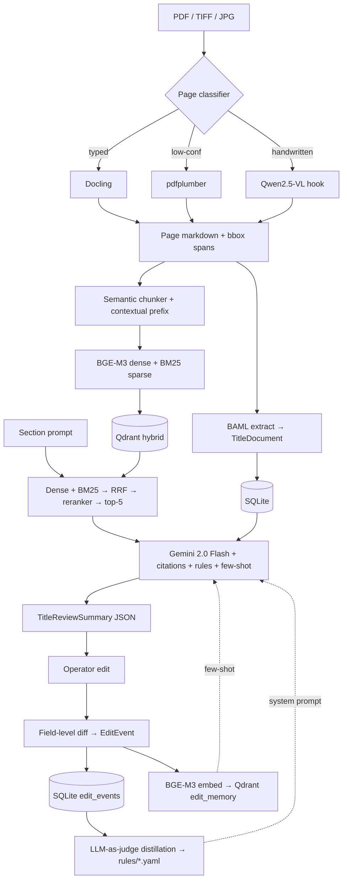

# Titan — Title Review AI

A take-home for Pearson Specter Litt. Ingest messy real-estate title documents, pull structured facts out of them, retrieve the relevant passages, and draft a cited ALTA-style **Title Review Summary** that an operator can edit. The system learns from those edits and applies the patterns to the next draft.

Author: S. M. Hozaifa Hossain
Submission date: May 15, 2026
Repo collaborators: [@tsensei](https://github.com/tsensei), [@abubakarsiddik31](https://github.com/abubakarsiddik31)

---

## What it does

You hand it a PDF — a title commitment, a deed, a mortgage, a handwritten conveyance, a tax certificate, whatever. It does five things:

1. **Parses the file.** Digital PDFs go through Docling. Scanned/typed pages fall back to pdfplumber. Handwritten pages route to a Qwen2.5-VL hook (transcript fixtures included so the demo runs without paying for the VLM).
2. **Extracts a typed `TitleDocument` schema** with character-level provenance via BAML + Gemini 2.0 Flash. There's a deterministic regex/heuristic fallback so the pipeline still runs with no API key.
3. **Builds a hybrid index** — BM25 sparse + BGE-M3 dense embeddings in Qdrant, fused with Reciprocal Rank Fusion, reranked by bge-reranker-v2-m3. Each chunk keeps its `{doc_id, page, char_span}` so citations are inspectable end-to-end.
4. **Drafts a `TitleReviewSummary`** — eight ALTA sections (Vesting, Legal Description, Chain of Title, Open Encumbrances, Easements, Schedule B-I, Schedule B-II, Taxes/Survey). Every section is generated against retrieved evidence with inline `[doc_id:page:span]` citations.
5. **Learns from operator edits.** A field-level diff is logged to SQLite, the edit pair is embedded into Qdrant as future few-shot fodder, and an LLM-as-judge pass distills the recent edits per-section into a versioned YAML rule set that gets injected into the prompt next time.

There's a Streamlit UI on top that lets you load a draft, edit the JSON in-place, and regenerate.

---

## Quick start

```bash
# 1. Install (uv is recommended; plain pip works too)
uv pip install -e .
#   or:  pip install -e .

# 2. Bring up Qdrant
docker compose up -d qdrant
#   Windows users can run  ./scripts/start_docker_and_qdrant.ps1
#   which also boots Docker Desktop if it isn't already running.

# 3. Run the demo on three sample docs
python -m titan.cli demo-ingest

# 4. Generate a cited draft
python -m titan.cli draft data/raw/commitment/wayne_county_commitment_0.pdf \
    --with-learning
```

The full eval (paired pre/post-learning):

```bash
python -m titan.cli eval-run
```

The Streamlit edit-and-regenerate UI:

```bash
streamlit run streamlit_app.py
```

API keys are optional. The pipeline works offline using local models and a heuristic extractor. If you want the full Gemini path, copy `.env.example` to `.env` and drop in a Google AI Studio key.

---

## Architecture (10-second tour)



Full architectural notes live in [docs/ARCHITECTURE.md](docs/ARCHITECTURE.md).

---

## Repository layout

```
titan/                      Source code
  config.py                 Pydantic Settings, env loading
  errors.py                 Domain exceptions
  schemas/                  TitleDocument, TitleReviewSummary, EditEvent
  ingest/                   Docling/pdfplumber OCR, page classifier, BAML extraction
  index/                    Chunker, BGE-M3 embed, Qdrant client
  retrieve/                 Hybrid BM25+dense, RRF fusion, BGE reranker
  draft/                    Section orchestrator + Gemini citation calls
  learn/                    Edit diff, embedding memory, rule distillation
  eval/                     Paired pre/post eval harness
  persist/                  SQLModel + SQLite operations
  telemetry/                Langfuse tracing, structlog config
  llm_client.py             Multi-provider LLM client with timeouts
  llm_cache.py              Disk-backed response cache
  cli.py                    `python -m titan.cli ...`

baml_src/                   BAML extraction prompts + types
rules/                      Distilled YAML rules per section
data/
  raw/                      Source PDFs (sample fixtures committed)
  gold/                     Hand-labelled gold JSONs + transcript fixtures
  out/                      Generated drafts (gitignored)
examples/                   Reviewer-friendly v1/v2/edited artifacts
eval/                       results_pre.json, results_post.json
tests/                      Pytest suite
scripts/                    Setup helpers (incl. Docker bring-up for Windows)
streamlit_app.py            Edit / regenerate UI
docker-compose.yml          Qdrant container
Dockerfile                  Reproducible runtime image
```

---

## Sample input & output

The `examples/` folder has everything a reviewer needs without running anything:

- `examples/input.pdf` — Wayne County commitment (clean digital PDF).
- `examples/output_v1.json` — first-pass draft (no learning).
- `examples/edited_v1.json` — simulated operator edits applied.
- `examples/edits.json` — the captured `EditEvent` records.
- `examples/rules_s4_open_encumbrances_and_liens.yaml` — rules distilled from those edits.
- `examples/output_v2.json` — regenerated draft using the rules + few-shot edits.

For a side-by-side with the human gold, see `data/gold/wayne_county_commitment_0.TitleReviewSummary.gold.json`.

---

## Evaluation

Three held-out docs (Wayne County commitment, OSMRE deed of trust, 1875 handwritten deed), paired conditions, run with `python -m titan.cli eval-run`:

| Metric | No learning | With learning | Δ |
|---|---:|---:|---:|
| **Field edit distance** (lower is better) | 0.908 | 0.727 | **−19.9%** |
| **Answer relevancy** (higher is better) | 0.729 | 0.738 | +0.010 |
| **Retrieval recall@5** (gold spans) | 0.667 | 0.667 | — |
| **Citation accuracy** | 0.067 | 0.056 | −0.011 |
| **Rule application rate** | 0.000 | 0.667 | +0.667 |
| **Edit memory size** | 0 | 24 | +24 |

Edit distance is the headline number — the same documents get noticeably closer to gold after the system has seen 24 simulated operator edits and run one rule-distillation pass. The full per-doc breakdown is in `eval/results_pre.json` and `eval/results_post.json`. More detail on methodology, why these metrics, and what's still weak in [docs/EVALUATION.md](docs/EVALUATION.md).

---

## Assumptions and tradeoffs

The compressed version (full version in [docs/ASSUMPTIONS.md](docs/ASSUMPTIONS.md)):

- **Output is grounded, not correct.** The brief says correctness isn't being graded. Every claim in a draft carries a citation; the operator decides if it's right.
- **Learning is retrieval, not fine-tuning.** Past edits become few-shot examples and distilled rules. RLHF/DPO in 22 hours would have been theatre.
- **Offline parity.** Every external call has a fallback: Docling → pdfplumber, Gemini extraction → regex, BGE remote → local. Reviewers without keys still get a working pipeline.
- **SQLite for persistence.** One file, zero infra. Scales fine for tens of thousands of edits.
- **PDFs in `data/raw/`** are committed for reproducibility. Reviewers don't have to scrounge for samples.
- **A real Qwen2.5-VL call is a wiring change, not a re-architecture.** The page classifier already routes to it.

---

## Code quality

- Pydantic v2 throughout — no raw dicts crossing module boundaries.
- Async where it pays (OCR, embed, retrieval); sync everywhere else.
- `tenacity` retries on every external call, exponential backoff, capped at 3.
- Domain errors (`OCRFailedError`, `LowConfidenceError`) defined in `titan/errors.py`.
- `structlog` with per-request `trace_id` correlation; Langfuse `@observe` on every LLM-touching function.
- `ruff check` is clean.
- `pytest` suite covers ingest, index/chunker, index/embed, retrieve, draft, learn, eval, persist, and schemas — at least one happy-path test per module.

---

## What I'd do with more time

- Parallelise the eight section calls with `asyncio.gather`. They're independent and currently sequential; rough math says 4× faster on generation.
- Migrate from `google-generativeai` to the newer `google.genai` SDK once it stabilises in BAML.
- Plug in Patronus Lynx for sentence-level hallucination detection. The citation tag pattern catches most of it, but Lynx would tighten the unsupported-generation control.
- Run the eval on 15–20 docs to get a real confidence interval on edit-distance reduction. Three is enough to show the loop works; it isn't enough to claim a number.
- Build a hosted Qwen2.5-VL endpoint and remove the transcript fixture path for handwriting.

---

## Submission notes

- Repo: `github.com/hozaifa1/pearson-specter-titan`
- Collaborators added: `@tsensei`, `@abubakarsiddik31`
- Notification email: `talha@ideabuilders.studio`

---

## License

MIT.
