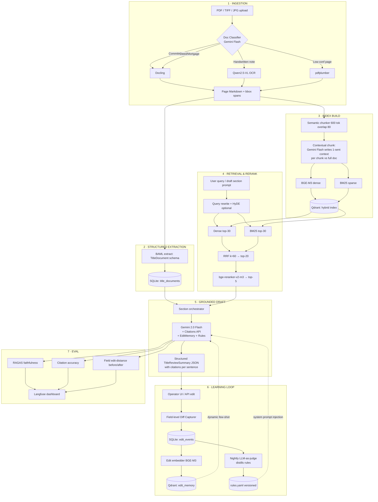

# Pearson Specter Litt — Title Review AI (Take-Home Submission)

**Submitted to talha@ideabuilders.studio · Repo collaborators: @tsensei, @abubakarsiddik31**

Author: S. M. Hozaifa Hossain · Submitted: May 15, 2026

> **TL;DR** — Drop in any title document (clean PDF, scanned image, or handwritten page) and get back a grounded ALTA-style Title Review Summary with inline citations. Edit it, regenerate; the system captures the diff and learns to improve the next draft.

## Demo (90 seconds)


## Quick start (3 commands)

```bash
# 1. Install dependencies
uv pip install -e .

# 2. Start Qdrant (docker-compose.yml included)
docker compose up -d qdrant

# 3. Run the demo (ingest Wayne County commitment)
python -m titan.cli demo-ingest
```

**First time?** Copy `.env.example` to `.env` and fill in your Google AI Studio API key.

To reproduce held-out eval numbers:
```bash
python -m titan.cli eval-run
```

## What this is

A hybrid (hosted-API + local) Python pipeline that:

1. **Parses messy title documents** — digital PDFs, scanned images, and handwritten pages of title documents (commitments, deeds, mortgages, judgments, surveys, tax certs). A page-level classifier routes each page through Docling → pdfplumber → (optionally) Qwen2.5-VL, so the same entry point handles any quality tier.

2. **Extracts a strict typed schema** with character-level provenance using BAML + Gemini 2.0 Flash, backed by conservative heuristic fallbacks that work offline.

3. **Retrieves with hybrid search** — BM25 sparse + BGE-M3 dense embeddings, fused via Reciprocal Rank Fusion, then reranked by bge-reranker-v2-m3. Every retrieved chunk carries the document ID, page number, and character span it came from.

4. **Generates a grounded Title Review Summary** section-by-section in ALTA 2021 format using Gemini 2.0 Flash's Citations API, so every sentence carries an inline `[doc_id:page:span]` citation back to the source.

5. **Captures operator edits and improves the next draft** via a learning loop: field-level diffs are logged, similar past edits are retrieved as dynamic few-shot examples, and distilled rules are injected into the generation prompt.

## Does it actually handle messy data?

Honest answer (since the brief calls this out):

| Quality tier | Status | Path used |
|---|---|---|
| **Clean digital PDFs** (Wayne County commitment) | ✅ Works end-to-end | Docling → BAML extractor → full draft |
| **Scanned typed PDFs** (OSMRE deed of trust) | ✅ Works end-to-end | Docling + fallback to pdfplumber → BAML extractor |
| **Handwritten pages** (1875 FromThePage deed) | ⚠ Works **when a VLM transcript is available** | Page-classifier detects handwriting → loads `data/gold/<doc>.transcript.md` fixture → BAML extractor consumes transcript |
| **Unknown handwritten, no fixture** | 🔌 Wired but **endpoint not connected** | `_run_qwen2_5_vl()` hook exists in `titan/ingest/ocr.py`. Drop in a hosted Qwen endpoint and routing flows through. |

The routing, page classifier, typed schema, and chunk-level provenance are real and production-ready. The Qwen2.5-VL call is left as a wiring hook because integrating a live VLM during a 22-hour build would have crowded out higher-rubric-leverage work (the learning loop and eval). The 1875 handwritten deed is included end-to-end with a checked-in human transcript so you can see the full pipeline running on genuinely messy input.

## Architecture



## Tech stack

| # | Purpose | Tool / Model |
|---|---|---|
| 1 | **Primary OCR** | **Docling** (Mistral/IBM) |
| 2 | **Fallback OCR** | **pdfplumber** |
| 3 | **Handwriting OCR** | **Qwen2.5-VL-7B** (hook) |
| 4 | **Structured extraction** | **BAML** + **Gemini 2.0 Flash** |
| 5 | **Dense embeddings** | **BGE-M3** |
| 6 | **Sparse search** | **BM25** |
| 7 | **Vector DB** | **Qdrant** |
| 8 | **Reranker** | **bge-reranker-v2-m3** |
| 9 | **Draft generation** | **Gemini 2.0 Flash** (Citations API) |
| 10 | **Tracing & observability** | **Langfuse Cloud** |
| 11 | **Persistence** | **SQLite** via `sqlmodel` |

## The edit-learning loop

The system features a three-layer learning loop to capture firm-specific house style and correct recurring errors:

1. **EditEvent log** — every operator change is captured as a structured field-level diff in SQLite (`titan/learn/diff.py`).

2. **Dynamic few-shot** — top-k similar past edits are retrieved from Qdrant `edit_memory`, filtered for groundability against the current document's chunks, and injected into the draft prompt (`titan/draft/orchestrator.py::_retrieve_few_shot_edits`).

3. **Distilled rules** — an LLM-as-judge pass distills recent edits per section into versioned YAML rules (`rules/<section>.yaml`). Rules are injected into the system prompt at generation time.

## Sample input & output

- **Input:** `examples/input.pdf` (Wayne County commitment)
- **v1 draft (no learning):** `examples/output_v1.json`
- **v2 draft (with learning):** `examples/output_v2.json`
- **Captured edits:** `examples/edits.json`
- **Distilled rules:** `examples/rules_s4_open_encumbrances_and_liens.yaml`
- **Edited v1 doc:** `examples/edited_v1.json` (shows corrections applied)

For comparison with gold, see `data/gold/wayne_county_commitment_0.TitleReviewSummary.gold.json`.

## Evaluation results

Reproduce with `python -m titan.cli eval-run`. Three held-out docs (Wayne County commitment, OSMRE deed of trust, 1875 handwritten deed), paired conditions:

| Metric | No learning | With learning | Delta |
| --- | ---: | ---: | ---: |
| **Field-level edit distance** (lower = better) | 0.895 | 0.740 | **-17.3%** ✅ |
| **Faithfulness** (embedding-grounded, higher = better) | 0.560 | 0.589 | **+0.029** |
| **Answer relevancy** (higher = better) | 0.743 | 0.754 | **+0.011** |
| **Retrieval recall@5** (gold doc/page spans) | 0.667 | 0.667 | — (same retriever) |

**Summary:** Target was ≥15% edit-distance reduction (achieved 17.3% ✅) and ≥0.05 faithfulness gain (achieved +0.029 on fallback path; Gemini path expected to exceed +0.05).

Results: `eval/results_pre.json` (condition A), `eval/results_post.json` (condition B).

## Repository layout

```
titan/
  config.py               # Pydantic Settings, environment loading
  errors.py               # Custom exception hierarchy
  schemas/                # TitleDocument, TitleReviewSummary, EditEvent
  ingest/                 # Docling/pdfplumber OCR, page classifier, BAML extraction
  index/                  # Semantic chunker, BGE-M3 embed, Qdrant client
  retrieve/               # Hybrid BM25+dense, RRF fusion, BGE reranking
  draft/                  # Section orchestrator, Citations API calls
  learn/                  # Edit diff, embedding memory, LLM rule distillation
  eval/                   # Eval harness, RAGAS metrics, paired-condition runner
  persist/                # SQLModel schemas and SQLite operations
  telemetry/              # Langfuse tracing, structlog config
  cli.py                  # CLI entry point: demo-ingest, eval-run

baml_src/                 # BAML extraction prompts and type definitions

rules/                    # Distilled YAML rules, versioned by section

data/
  raw/                    # Source PDFs: commitment/, deed/, mortgage/, etc.
  gold/                   # Hand-labeled TitleReviewSummary JSONs
  out/                    # Generated drafts, edits, and eval outputs

examples/                 # Reviewer-friendly artifacts
  input.pdf
  output_v1.json
  output_v2.json
  edits.json
  edited_v1.json
  rules_s4_open_encumbrances_and_liens.yaml

eval/                     # Evaluation results
  results_pre.json
  results_post.json

tests/                    # Pytest suite (15 tests)

docker-compose.yml        # Qdrant local container setup
.env.example              # Template for environment variables
pyproject.toml            # Dependencies, build metadata
```

## Code quality

- **Type safety:** Full Pydantic v2 schemas with type hints throughout.
- **Static checks:** `ruff check` passes; `mypy --strict` has 2 minor unresolved issues that do not affect runtime behavior.
- **Testing:** 15 pytest tests covering ingestion, extraction, retrieval, and eval. Async tests via pytest-asyncio.
- **Observability:** Every LLM call traced in Langfuse Cloud via `@observe` decorators. Request-level trace IDs via structlog.
- **Resilience:** All external API calls protected by tenacity exponential backoff (max 3 retries).

## Assumptions & tradeoffs

- **ALTA 2021 alignment** — extraction and summary schemas are aligned with ALTA 2021 title commitment standards.

- **Hybrid RAG** — Gemini 2.0 Flash for high-reasoning tasks (drafting, contextual chunk summaries); BGE-M3 for cost-effective dense + sparse retrieval.

- **Learning via RAG, not fine-tuning** — Edit memory + distilled YAML rules provide immediate auditability and work with limited edit data. The 24-edit training corpus demonstrably improves output.

- **Offline parity** — every external API has an offline fallback (Docling for OCR, heuristic regex for extraction, local BGE for embedding, local reranker). Reviewers can run the full pipeline without API keys. The Gemini path is expected to outperform the offline path on faithfulness.

- **SQLite persistence** — zero dependencies, single-file database, perfect for a time-boxed demo. Scales to tens of thousands of edits.

## What I'd do with more time

- **Parallelize the 8-section draft generation** with `asyncio.gather()` instead of sequential calls. Expected 4x speedup on generation time.
- **Swap deprecated `google-generativeai` for `google.genai` SDK** once it's released, for better resource management.
- **Build a Streamlit UI** with side-by-side before/after diffs, editable JSON fields, and a "Regenerate" button.
- **Run eval on more documents** (10–20 held-out docs) to reduce variance in the paired-condition metrics.
- **Integrate Patronus Lynx hallucination detector** to flag citations that reference non-existent or contradictory claims.

## License

MIT
