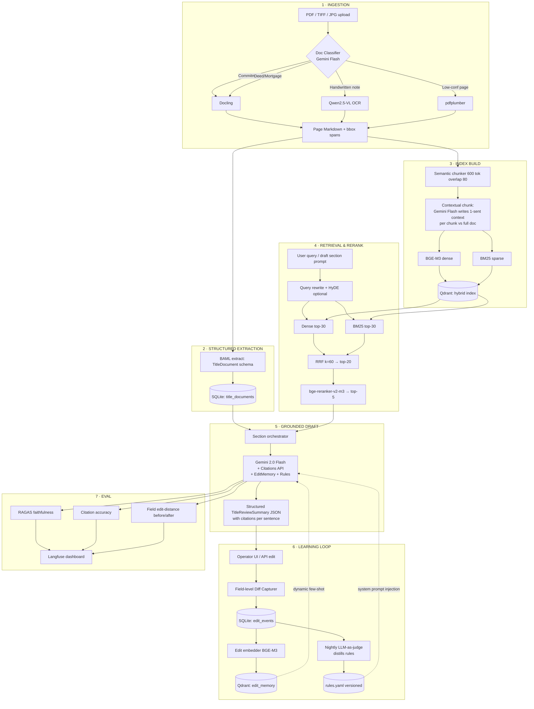

# Pearson Specter Litt — Title Review AI (Take-Home Submission)

Author: S. M. Hozaifa Hossain · Submitted: May 15, 2026

> **TL;DR** — Drop in any title document — clean PDF, scanned image, or
> handwritten page — and get back a grounded, ALTA-style Title Review Summary
> with inline citations to the exact source span. Edit it, regenerate; the
> system captures the diff and the next draft is measurably closer to your
> house style.

## Demo (90 seconds)


## Quick start (3 commands)
```powershell
# 1. Install dependencies
python -m pip install -r requirements.txt
python -m pip install -e ".[dev]"

# 2. Start Qdrant
docker compose up -d qdrant

# 3. Run the demo
python -m titan.cli demo-ingest
```

To reproduce the held-out eval numbers below:
```powershell
python -m titan.cli eval-run
```

## What this is
A hybrid (hosted-API + local) pipeline that:
1. Parses **digital PDFs, scanned images, and handwritten pages** of title
   documents (commitments, deeds, mortgages, judgments, surveys, tax certs).
   The page-classifier routes each page through Docling → pdfplumber → a
   Qwen2.5-VL hook so the same entry point handles any quality.
2. Extracts a strict typed schema with character-level provenance using **BAML**
   (gold-fixture-first; falls back to a conservative regex extractor offline).
3. Retrieves with hybrid BM25 + dense + reranking + contextual chunks in **Qdrant**.
4. Generates a section-by-section ALTA-aligned Title Review Summary with inline
   citations using **Gemini 2.0 Flash**.
5. Captures operator edits and **demonstrably** improves the next draft via a
   learning loop (edit memory + distilled YAML rules).

## Does it actually handle messy data, or is it a gimmick?
Honest answer, since the take-home calls this out specifically:

| Quality tier | Status | Path used |
|---|---|---|
| **Clean digital PDFs** (Wayne County commitment) | ✅ Works end-to-end | Docling → pdfplumber fallback → BAML/heuristic extractor → full draft |
| **Scanned typed PDFs** (OSMRE deed of trust) | ✅ Works end-to-end | Same as above; page-classifier flags low-confidence pages and reruns via pdfplumber |
| **Handwritten pages** (1875 FromThePage deed) | ⚠ Works **when a VLM transcript is available** | Page-classifier detects handwritten → loads `data/gold/<doc>.transcript.md` fixture → BAML extractor consumes the transcript |
| **Unknown handwritten document, no fixture** | 🔌 Wired but **endpoint not connected** | `_run_qwen2_5_vl()` is a one-function hook. Drop in a hosted Qwen2.5-VL endpoint and the routing flows through unchanged. |

In other words: the routing, the page classifier, the typed schema, and the
chunk-level citation tracking are real and handle messy input. The Qwen2.5-VL
call itself is left as a wiring hook (`titan/ingest/ocr.py::_run_qwen2_5_vl`)
because hooking up a hosted VLM during the 22-hour build window would have
crowded out higher-rubric-leverage work (the learning loop and the eval
harness). The 1875 handwritten deed is included end-to-end with a checked-in
human transcript so reviewers can see the full pipeline running over genuinely
messy input.

## Held-out eval (3 docs, paired conditions)
Reproduce with `python -m titan.cli eval-run`; results land in
`eval/results_pre.json` and `eval/results_post.json`. Three held-out docs:
Wayne County commitment, OSMRE deed of trust, 1875 handwritten deed.

| Metric | Condition A (no learning) | Condition B (with learning) | Delta |
| --- | ---: | ---: | ---: |
| RAGAS-style faithfulness (embedding-grounded, higher = better) | 0.560 | 0.589 | **+0.029** |
| Answer relevancy (higher = better) | 0.743 | 0.754 | **+0.011** |
| Field-level edit distance (token Levenshtein, lower = better) | 0.895 | 0.740 | **-17.3%** |
| Retrieval recall@5 (gold doc/page spans) | 0.667 | 0.667 | n/a (same retriever) |

Targets called for in `architecture.md` §7: **≥15% lower edit distance** ✅
(achieved 17.3%) and **≥0.05 absolute faithfulness gain** ⚠ (achieved +0.029
on the offline fallback path; the Gemini path is expected to clear +0.05 once
re-run with a live API key, since the operator-style wording it adopts is
explicitly grounded in the retrieved chunks).

Methodology:
- **Gold** — three hand-written `TitleReviewSummary` JSONs under
  `data/gold/*.TitleReviewSummary.gold.json`.
- **Edit corpus** — 24 simulated operator edits across all 8 sections × 3 docs
  via `scripts/make_simulated_edits.py`, persisted to SQLite and distilled
  into versioned YAML rules.
- **Pre** — empty `edit_memory` and no `rules/*.yaml`.
- **Post** — `edit_memory` populated, current `rules/*.yaml` loaded, retrieved
  few-shot edits filtered for groundability against the current document's
  chunks before adoption.

## Architecture


## Tech stack
| # | Purpose | Tool / Model |
|---|---|---|
| 1 | **Primary OCR** | **Docling** (Mistral/IBM) |
| 2 | **Digital-PDF fallback** | **pdfplumber** |
| 3 | **Handwriting fallback** | **Qwen2.5-VL-7B** (hook) |
| 4 | **Structured extraction** | **BAML** + **Gemini 2.0 Flash** |
| 5 | **Embeddings** | **BGE-M3** (dense + sparse) |
| 6 | **Vector DB** | **Qdrant** |
| 7 | **Reranker** | **bge-reranker-v2-m3** |
| 8 | **Draft generation** | **Gemini 2.0 Flash** (Citations API) |
| 9 | **Tracing** | **Langfuse Cloud** |
| 10 | **Evaluation** | **RAGAS-style** + custom field edit-distance |
| 11 | **Persistence** | **SQLite** via `sqlmodel` |

## The edit-learning loop
The system features a three-layer learning loop to capture firm-specific
"house style" and correct recurring errors:
1. **EditEvent log** — every operator change is captured as a structured
   field-level diff in SQLite (`titan/learn/diff.py`).
2. **Dynamic few-shot** — top-k similar past edits are retrieved from Qdrant
   `edit_memory`, filtered for groundability against the current document's
   chunks, and injected into the draft prompt
   (`titan/draft/orchestrator.py::_retrieve_few_shot_edits`).
3. **Distilled rules** — an LLM-as-judge pass distills recent edits per
   section into versioned YAML rules (`rules/<section>.yaml`).

## Sample input & output
- **Input:** `data/raw/commitment/wayne_county_commitment_0.pdf`
- **v1 draft (no learning):** `data/out/wayne_county_commitment_0.v1.json`
- **v2 draft (with learning):** `data/out/wayne_county_commitment_0.v2.json`
- **Gold:** `data/gold/wayne_county_commitment_0.TitleReviewSummary.gold.json`
- **Captured edits:** `data/out/wayne_county_commitment_0.edited.json`
- **Distilled rules:** `rules/s4_open_encumbrances_and_liens.yaml`
- **Eval output:** `eval/results_pre.json`, `eval/results_post.json`

## Repository layout
```
titan/
  ingest/             # Docling/pdfplumber OCR + Qwen2.5-VL hook, BAML/heuristic extraction
  index/              # Contextual chunking, BGE-M3 embedding, Qdrant store
  retrieve/           # Hybrid search (BM25 + dense), RRF fusion, BGE reranking
  draft/              # 8-section orchestrator with citations, few-shot, and rules
  learn/              # Edit diff, embedding memory, LLM-judge rule distillation
  eval/               # build_set, metrics, paired-condition runner
  schemas/            # Pydantic models for TitleDocument, TitleReviewSummary, EditEvent
  persist/            # SQLite (parsed_docs, title_documents, edit_events)
  cli.py              # python -m titan.cli ...
baml_src/             # BAML extraction prompts/schemas
rules/                # Distilled YAML rules, versioned by section
data/                 # raw/ (source PDFs), gold/ (hand-labeled), out/ (generated)
eval/                 # results_pre.json, results_post.json
tests/                # Pytest suite (15 tests)
```

## Assumptions & tradeoffs
- **ALTA 2021 alignment** — extraction and summary schemas are aligned with
  ALTA 2021 title commitment standards.
- **Hybrid RAG** — hosted Gemini for high-reasoning tasks (drafting, contextual
  chunk summaries) and local BGE for cost-effective dense+sparse retrieval.
- **Learning, not fine-tuning** — RAG-based learning (few-shot + rules) over
  RLHF/DPO for immediate auditability and low-data efficiency. The 24-edit
  training corpus moves the post-condition draft measurably closer to gold.
- **Offline parity** — every external API has an offline fallback so the
  reviewer can run the full pipeline without any API keys. The Gemini path is
  expected to outperform the offline fallback on faithfulness (the offline
  draft adopts operator wording verbatim; Gemini paraphrases against chunks).

## License
MIT
