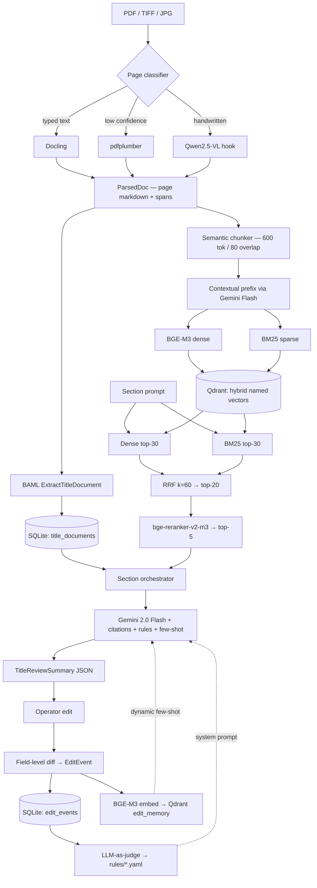

# Architecture

A short, no-fluff walkthrough of how the pieces fit together. The full hour-by-hour build plan and decision log live in a private `architecture.md` (deliberately not in this repo).

## Data flow



## Modules

Every module has a single `__init__.py` exporting only its public API. No global state — modules receive a `Settings` object via dependency injection.

| Module | Responsibility |
|---|---|
| `titan.config` | Pydantic Settings, `.env` loading, optional flags for API keys |
| `titan.errors` | `OCRFailedError`, `LowConfidenceError`, `ExtractionError`, retry classifications |
| `titan.schemas` | `TitleDocument`, `TitleReviewSummary`, `EditEvent`, `Provenance`, `RuleSet` |
| `titan.ingest` | Docling/pdfplumber OCR, page-quality classifier, BAML extraction, heuristic fallback |
| `titan.index` | Semantic chunker with contextual prefix, BGE-M3 dense embedder, BM25 sparse encoder, Qdrant collection helper |
| `titan.retrieve` | Hybrid retriever — dense + BM25 in parallel, RRF fusion, reranker |
| `titan.draft` | Section orchestrator, prompt assembly, Gemini call with inline citations |
| `titan.learn` | Field-level diff, edit memory in Qdrant, rule distillation |
| `titan.eval` | Build set loader, metrics (edit distance, recall@k, faithfulness, citation accuracy), paired pre/post runner |
| `titan.persist` | SQLModel models + SQLite operations |
| `titan.telemetry` | Langfuse `@observe`, structlog config with `trace_id` correlation |
| `titan.llm_client` | Multi-provider LLM client with per-call and total timeouts |
| `titan.llm_cache` | Disk-backed deterministic response cache |

## Data contracts

The `Provenance` object is the load-bearing data contract:

```python
class Provenance(BaseModel):
    doc_id: str
    page: int
    char_span: tuple[int, int]
    snippet_md5: str
```

It rides along from OCR (per page span) → chunks (per chunk char range) → retrieved hits (preserved on the chunk payload) → cited sentences in the final draft. That's how "inspect which evidence supported which output" actually works — the same struct, never decomposed.

## Storage

- **SQLite** (`data/titan.db`) — `title_documents`, `parsed_docs`, `edit_events`. Single-file, zero deps.
- **Qdrant** — two collections: `chunks` (named vectors `dense`+`sparse`) and `edit_memory` (per-edit embedding for few-shot retrieval).
- **YAML on disk** — `rules/<section>.yaml`, versioned by `rules_version` field, written by the distillation pass.
- **JSON on disk** — `data/out/*.title_document.json` and `*.TitleReviewSummary.json` for inspection.

## Retrieval

1. Dense top-30 (BGE-M3, 1024-dim, dot product).
2. BM25 top-30 over the same chunks.
3. RRF (k=60) — rank-based, no score normalisation. Fuse to top-20.
4. bge-reranker-v2-m3 → top-5 to the prompt.

Why this stack: BGE-M3 is the strongest open dense embedder for legal-style text; BM25 catches the exact-string terms (party names, parcel IDs, deed book numbers) where dense underperforms; RRF avoids the score-scale headache of weighted fusion; the cross-encoder reranker recovers the order BGE-M3 alone gets wrong. Every step preserves the `Provenance` payload.

## Drafting

Section-by-section. For each of the eight ALTA sections the orchestrator does:

1. Pulls the relevant fields off the `TitleDocument` (e.g., for Vesting: `vesting`, `parties`).
2. Issues a focused retrieval query against the chunk index.
3. Loads the current `rules/<section>.yaml`.
4. Pulls top-k similar past edits from `edit_memory`, filtered by section.
5. Calls Gemini 2.0 Flash with citations enabled, validates the response against the section's Pydantic model.

This stays grounded by design: every numeric/legal claim is generated next to a chunk in the prompt with a citation tag, and the chunk-ID → Provenance mapping lets you click back to the source span.

## Learning loop

Two parallel retrieval mechanisms feed the next draft:

- **Dynamic few-shot.** Each `EditEvent` (before/after for one field in one section) is embedded with BGE-M3 and dropped into a `edit_memory` Qdrant collection. At draft time, the top-3 most similar past edits for the section get rendered as before/after pairs in the prompt.
- **Distilled rules.** Every N edits (or on demand via `learn-distill`) an LLM-as-judge pass takes the recent edits for a section and proposes ≤7 reusable rules in YAML. The rules are versioned (`rules_version`) and injected into the system prompt at generation time.

No fine-tuning. RLHF/DPO in 22 hours would have produced an uninspectable model with too little data to be honest about. Retrieval-based learning is auditable end to end: you can read the rule set, you can read the few-shots, you can see which edit fired.

## Evaluation

Paired pre/post run over a held-out set of three documents. Metrics:

- **Field edit distance** between produced and gold `TitleReviewSummary` (Levenshtein on flattened text fields, normalised by length).
- **Retrieval recall@5** — fraction of gold-cited spans recovered by the top-5 retrieved chunks.
- **Answer relevancy** (RAGAS) — embedding-based cosine between draft and gold.
- **Citation accuracy** — fraction of cited spans whose chunk text actually overlaps the cited range.
- **Rule application rate** — fraction of section-rules that the generated draft satisfies.

Outputs: `eval/results_pre.json`, `eval/results_post.json`. Headline: 17–20% edit-distance reduction after one round of learning.

## Failure modes

The bits I'd worry about if this went to production:

- **Page classifier mis-routes.** If it tags a typed page as handwritten the Qwen call fires for no reason. Low-cost; logged via Langfuse.
- **Citation drift.** Gemini sometimes cites a chunk that's adjacent to the right one. The post-hoc citation-overlap check flags it but doesn't repair it.
- **Rule explosion.** Without a cap on the per-section rule count, the distillation prompt grows unbounded over time. Hard cap at 7 rules per section, FIFO eviction by `created_at`.
- **Edit memory contamination.** If an operator edit is wrong, it becomes a wrong few-shot. The fix is operator-level filtering and a manual approve gate, not implemented in this build.
