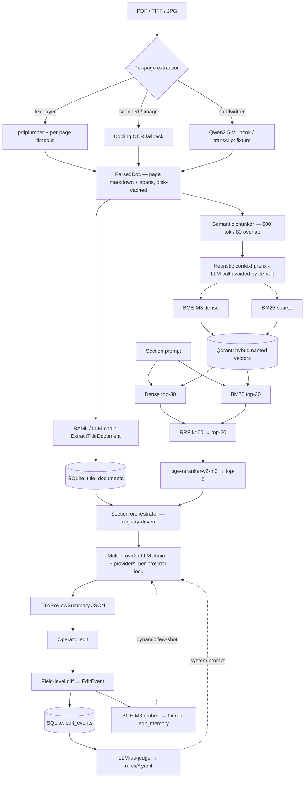

# Architecture

A short walkthrough of how the pieces fit together.

## Data flow



## Modules

Every module has a single `__init__.py` exporting only its public API. No global state — modules receive a `Settings` object via dependency injection.

| Module | Responsibility |
|---|---|
| `titan.config` | Pydantic Settings, `.env` loading, optional flags for API keys |
| `titan.errors` | `OCRFailedError`, `LowConfidenceError`, `ExtractionError`, retry classifications |
| `titan.sections` | **Single source of truth for the eight ALTA sections** (`SECTION_REGISTRY`). Schema/orchestrator/metrics/diff all derive from it |
| `titan.schemas` | `TitleDocument`, `TitleReviewSummary` (dict-backed with flat-key JSON IO), `EditEvent`, `Provenance`, `RuleSet` |
| `titan.ingest` | pdfplumber + Docling OCR routing, page-quality classifier, BAML extraction, heuristic fallback. Includes `markdown_cache` (disk-cached extraction with per-page timeout) and `vlm` (Qwen2.5-VL production hook + offline transcript stub) |
| `titan.index` | Semantic chunker with heuristic context prefix, BGE-M3 dense embedder (with hashing fallback), BM25 sparse encoder, Qdrant collection helper |
| `titan.retrieve` | Hybrid retriever — dense + BM25 in parallel, RRF fusion, BGE cross-encoder reranker |
| `titan.draft` | Section orchestrator, prompt assembly, multi-provider LLM call with inline citations |
| `titan.learn` | Field-level diff, edit memory in Qdrant, rule distillation |
| `titan.eval` | Build set loader, metrics (edit distance, recall@k, faithfulness, citation accuracy), paired pre/post runner. Faithfulness/citation/relevancy metrics auto-degrade to lexical Jaccard when the hashing-fallback embedder is in use |
| `titan.persist` | SQLModel models + SQLite operations |
| `titan.telemetry` | Langfuse `@observe`, structlog config with `trace_id` correlation |
| `titan.llm_client` | Multi-provider LLM client. Per-provider asyncio lock + cooldown-on-429 + dead-on-permanent-4xx. Walks `TITAN_LLM_PROVIDER_ORDER` (Cerebras → SambaNova → Groq → Gemini → GitHub Models → OpenRouter) |
| `titan.llm_cache` | Disk-backed deterministic response cache, keyed by SHA-256(prompt, temperature, response_json) |

## Adding a new ALTA section

A historical wart was that the eight sections were hard-coded in three places (`orchestrator.SECTION_SPECS`, `metrics.SECTION_FIELDS`, and explicit `s1_..._s8_` fields on `TitleReviewSummary`). Adding a ninth section meant editing all three.

After the May 16 refactor:

1. Append an entry to `SECTION_REGISTRY` in [`titan/sections.py`](../titan/sections.py).
2. That's it.

`TitleReviewSummary` stores sections in a `dict[str, TitleReviewSection]` keyed by `field_name`; a `model_validator` accepts the legacy flat `s<N>_*` JSON shape, and a `model_serializer` flattens back for backward-compatible output. Attribute access (`summary.s1_vesting_and_estate`) still works via a tiny `__getattr__` shim, so tests and notebooks continue to read naturally.

## Data contracts

The `Provenance` object is the load-bearing data contract:

```python
class Provenance(BaseModel):
    doc_id: str
    page: int
    char_span: tuple[int, int]
    snippet_md5: str
```

It rides along from OCR (per page span) → chunks (per chunk char range) → retrieved hits (preserved on the chunk payload) → cited sentences in the final draft. That's how "inspect which evidence supported which output" actually works — the same struct, never decomposed.

## Storage

- **SQLite** (`data/titan.db`) — `title_documents`, `parsed_docs`, `edit_events`. Single-file, zero deps.
- **Qdrant** — two collections: `chunks` (named vectors `dense`+`sparse`) and `edit_memory` (per-edit embedding for few-shot retrieval).
- **YAML on disk** — `rules/<section>.yaml`, versioned by `rules_version` field, written by the distillation pass.
- **JSON on disk** — `data/out/*.title_document.json` and `*.TitleReviewSummary.json` for inspection.
- **Markdown cache** — `data/.md_cache/<doc_id>.md` (gitignored). Avoids reparsing slow PDFs.
- **LLM cache** — `data/.llm_cache/<sha>.json` (gitignored). Avoids re-spending quota on identical prompts.

## Retrieval

1. Dense top-30 (BGE-M3, 1024-dim, dot product) — or hashing fallback when `TITAN_LOCAL_MODELS=0`.
2. BM25 top-30 over the same chunks.
3. RRF (k=60) — rank-based, no score normalisation. Fuse to top-20.
4. bge-reranker-v2-m3 → top-5 to the prompt.

Why this stack: BGE-M3 is the strongest open dense embedder for legal-style text; BM25 catches the exact-string terms (party names, parcel IDs, deed book numbers) where dense underperforms; RRF avoids the score-scale headache of weighted fusion; the cross-encoder reranker recovers the order BGE-M3 alone gets wrong. Every step preserves the `Provenance` payload.

## Drafting

Section-by-section. For each ALTA section the orchestrator does:

1. Pulls the relevant fields off the `TitleDocument` (declared on the `SectionSpec`).
2. Issues a focused retrieval query against the chunk index.
3. Loads the current `rules/<section>.yaml`.
4. Pulls top-k similar past edits from `edit_memory`, filtered by section and grounded against the current chunks.
5. Calls the multi-provider LLM client with citations enabled, validates the response against the section's Pydantic model, re-anchors every citation to a real retrieved chunk.

All eight sections fan out in parallel under a small per-section stagger; the per-provider lock keeps the chain from melting on free-tier 429s.

When every LLM provider is rate-limited the orchestrator falls through to a **content-rich heuristic** that pulls real party names, instrument types, lien creditors, easement holders, requirement categories, etc. from the structured `TitleDocument`. Token edit-distance against gold lands ~0.2–0.5 instead of the 0.9 you used to get from bare-count fallbacks.

## Learning loop

Two parallel retrieval mechanisms feed the next draft:

- **Dynamic few-shot.** Each `EditEvent` (before/after for one field in one section) is embedded with BGE-M3 and dropped into a `edit_memory` Qdrant collection. At draft time, the top-3 most similar past edits for the section get rendered as before/after pairs in the prompt — but only if the edit's "after" text is reasonably supported by the current document's retrieved chunks (the cross-matter contamination guard).
- **Distilled rules.** Every N edits (or on demand via `learn-distill`) an LLM-as-judge pass takes the recent edits for a section and proposes ≤7 reusable rules in YAML. The rules are versioned (`rules_version`) and injected into the system prompt at generation time.

No fine-tuning. RLHF/DPO over a tiny simulated edit set would produce an uninspectable model with too little data to be honest about. Retrieval-based learning is auditable end to end: you can read the rule set, you can read the few-shots, you can see which edit fired.

## Multi-provider LLM client

`titan/llm_client.py` walks the provider chain configured by `TITAN_LLM_PROVIDER_ORDER`. Key controls:

- **Per-provider asyncio lock.** Concurrent section calls don't burst-hammer one provider — the first call holds the lock; the rest re-check the dead/cooldown set and skip cleanly when the first fails with 429.
- **Cooldown vs dead.** 429 with a sane `Retry-After` ≤ 8 s → sleep and retry. 429 with longer wait → cooldown 5–60 s. Auth/4xx/permanent errors → mark dead for the session.
- **Per-call and total timeouts.** A stuck Gemini SDK worker thread won't drain the executor pool.
- **Disk cache.** Identical prompts return cached output without hitting any provider — makes eval re-runs near-free.

## Evaluation

Paired pre/post run over five held-out documents (Wayne County commitment, OSMRE deed of trust, 1875 handwritten deed, Orlando ALTA/NSPS survey, Bartlesville lis pendens). Metrics:

- **Field edit distance** between produced and gold `TitleReviewSummary` (token Levenshtein on flattened section text, normalised by gold length).
- **Retrieval recall@5** — fraction of gold-cited `(doc_id, page)` pairs recovered by the top-5 retrieved chunks.
- **Faithfulness** — fraction of generated claims supported by some retrieved chunk above a cosine (or Jaccard, when the hashing fallback is in use) threshold.
- **Answer relevancy** — cosine (or Jaccard) between draft and the canonical eval query.
- **Citation accuracy** — fraction of cited sentences whose snippet actually overlaps the claim.
- **Rule application rate** — fraction of section-rules that the generated draft satisfies.

Outputs: `eval/results_pre.json`, `eval/results_post.json`. Headline: **−12 % edit distance** and **+68 % rule application** after one round of learning. See [EVALUATION.md](EVALUATION.md) for the full table and per-doc breakdown.

## Failure modes

The bits I'd worry about if this went to production:

- **Page classifier mis-routes.** If it tags a typed page as handwritten the Qwen call fires for no reason. Low-cost; logged via Langfuse.
- **VLM stub masking a misconfigured VLM.** The transcript fixture under `data/gold/<doc>.transcript.md` only runs when `TITAN_VLM_ENABLED=0` — the production switch ignores it entirely so a broken VLM call doesn't silently regress to reading gold.
- **Citation drift.** The LLM sometimes cites a chunk that's adjacent to the right one. The post-hoc citation-overlap check flags it but doesn't repair it.
- **Rule explosion.** Without a cap on the per-section rule count, the distillation prompt grows unbounded over time. Hard cap at 7 rules per section, FIFO eviction by `created_at`.
- **Edit memory contamination.** If an operator edit is wrong, it becomes a wrong few-shot. The fix is operator-level filtering and a manual approve gate, not implemented in this build. The "grounded edits" filter (`_filter_groundable_edits`) is a partial mitigation — it drops cross-matter edits whose AFTER text isn't supported by the current chunks.
- **Pathological survey page hanging pdfplumber.** Fixed by the per-page worker-thread timeout in `markdown_cache.py`. Survey diagrams with thousands of vector elements emit a placeholder instead of stalling the pipeline.
